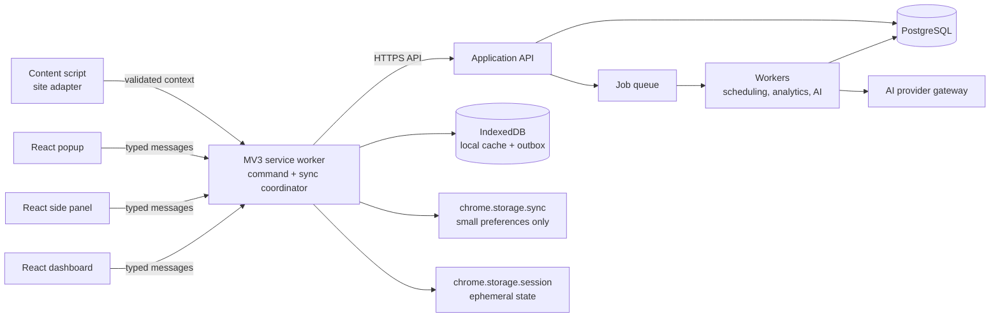

# DSA Coach — Technical Architecture

**Status:** proposed design; implementation must not begin until this document is approved.

## 1. Architecture goals

DSA Coach is a premium Chrome-first memory system for data-structures-and-algorithms interview preparation. It must capture meaningful problem-solving activity with consent, turn it into active-recall cards and revisions, and provide useful analytics without becoming another passive problem tracker.

The system is designed for 100,000+ users with these priorities:

1. **Trust and privacy:** collect the minimum page-derived data; never read credentials, private messages, or arbitrary page text.
2. **Fast local interaction:** opening the extension, reviewing a card, and saving a reflection must feel immediate even offline.
3. **Cloud-backed continuity:** users expect their preparation history to follow them across Chrome profiles and devices.
4. **Correct learning state:** revision scheduling and historical attempts are durable server-owned facts, not fragile browser-only state.
5. **Graceful evolution:** separate domain logic from extension APIs and AI providers so the product can grow without a rewrite.

## 2. Product surfaces

| Surface             | Job                                                                                | Why it exists                                                                    |
| ------------------- | ---------------------------------------------------------------------------------- | -------------------------------------------------------------------------------- |
| Toolbar popup       | One-glance daily status, quick capture, and a single primary action                | Fastest entry point; intentionally limited to avoid a crowded mini-app.          |
| Side panel          | In-context problem capture, recall prompt, hints, notes, and post-solve reflection | Persistent alongside an approved problem site; the primary extension experience. |
| Full-page dashboard | Calendar, analytics, card library, settings, and account management                | Complex analysis needs space and must not compromise solving flow.               |
| Content script      | Detects supported problem context and offers an unobtrusive capture affordance     | Site-specific parsing stays isolated from product UI and backend authority.      |
| Backend             | Canonical identity, data, scheduling, analytics, AI orchestration, and sync        | Enables cross-device continuity and protects business logic.                     |

The initial supported sites should be explicitly allowlisted (for example, LeetCode) and enabled only after a user action. New sites must be implemented by a dedicated adapter and reviewed for privacy and DOM resilience.

## 3. System design



**Decision:** Manifest V3 is required. Its service worker is event-based and may stop at any time, so it coordinates events but owns no in-memory source of truth. All durable local state is in IndexedDB or Chrome storage, and all canonical account data is in the cloud. Manifest V3 also prohibits remotely hosted executable code; every shipped script is bundled and reviewed. [Chrome MV3 documentation](https://developer.chrome.com/docs/extensions/develop/migrate/what-is-mv3)

## 4. Chrome extension architecture

### 4.1 Contexts and responsibilities

| Context            | Responsibilities                                                                                                               | Constraints                                                                                                                                                                                       |
| ------------------ | ------------------------------------------------------------------------------------------------------------------------------ | ------------------------------------------------------------------------------------------------------------------------------------------------------------------------------------------------- |
| Service worker     | Message router, authentication-token broker, API client, sync/outbox coordination, alarms, notification dispatch, action state | No DOM; short-lived; reload-safe.                                                                                                                                                                 |
| Content script     | Extract a strictly allowlisted `ProblemContext`; respond to capture requests; send site lifecycle events                       | Untrusted page-adjacent context; cannot access tokens or database.                                                                                                                                |
| Side panel         | Rich in-context React UI, draft notes, capture/review workflow                                                                 | Per-tab UI; must treat content-script data as untrusted input.                                                                                                                                    |
| Popup              | Daily due count, streak, open-panel/dashboard actions                                                                          | May close at any time; no background work.                                                                                                                                                        |
| Dashboard          | Full-page React experience and account/settings UI                                                                             | Uses same app/domain client as side panel, never direct privileged APIs.                                                                                                                          |
| Offscreen document | Not part of MVP; reserved for a legitimate DOM-only need such as clipboard interoperability                                    | Create only when justified; it has limited extension APIs and communicates through runtime messages. [Chrome offscreen API](https://developer.chrome.com/docs/extensions/reference/api/offscreen) |

### 4.2 Permissions and host access

Start with the smallest permission set: `storage`, `alarms`, `sidePanel`, and `notifications` (only after a user enables reminders). Use `activeTab` for user-initiated capture. Use optional, per-site host permissions for automatic context detection; never request broad `*://*/*` access.

**Decision:** the extension does not scrape every coding site by default. Optional host permissions make the benefit explicit, reduce Chrome Web Store review risk, and prevent accidental collection outside the product’s purpose.

### 4.3 Adapter boundary

Each supported site implements `ProblemSiteAdapter`: `matches(url)`, `extractContext()`, `observeSolvedState()`, and `buildCanonicalUrl()`. It returns only normalized metadata: provider, stable external ID when available, title, URL, difficulty, tags, and acceptance signal. The raw DOM and full page body never leave the tab.

Adapters are versioned and feature-flagged server-side as data configuration—not remotely loaded code. A broken selector disables a feature cleanly without changing extension behavior globally.

## 5. Communication contract

All extension-internal messages are discriminated, versioned TypeScript objects, validated at the receiver with a runtime schema. No context sends arbitrary objects or directly mutates another context’s state.

| Flow                                | Mechanism                                                    | Examples                                             |
| ----------------------------------- | ------------------------------------------------------------ | ---------------------------------------------------- |
| Content script → worker             | `chrome.runtime.sendMessage`                                 | `problem.context.detected`, `problem.solve.detected` |
| Worker → content script             | `chrome.tabs.sendMessage`                                    | `context.request`, `capture.started`                 |
| Popup/side panel/dashboard → worker | Request/response messages                                    | `review.next`, `capture.save`, `auth.start`          |
| Worker → active UI                  | Long-lived `runtime.Port` only while live updates are needed | sync status, card mutation, auth completion          |
| UI local state                      | React query cache plus IndexedDB repository                  | stale-while-revalidate views                         |

Chrome messaging uses JSON serialization, so the contract contains JSON-safe primitives only; dates are ISO strings and IDs are strings. [Chrome message passing](https://developer.chrome.com/docs/extensions/develop/concepts/messaging)

**Decision:** the service worker is the only privileged broker. This prevents content scripts from accessing account tokens, gives one place for retry/idempotency, and allows the UI to be tested independently of Chrome APIs.

## 6. Local storage versus cloud storage

| Store                        | Data                                                                         | Role                                        | Rationale                                                                                                                                                                                          |
| ---------------------------- | ---------------------------------------------------------------------------- | ------------------------------------------- | -------------------------------------------------------------------------------------------------------------------------------------------------------------------------------------------------- |
| IndexedDB (extension origin) | cached cards, recent problems, drafts, mutation outbox, cache metadata       | Local-first experience                      | Handles structured data at a scale Chrome sync cannot; works offline.                                                                                                                              |
| `chrome.storage.sync`        | theme, notification preferences, compact feature preferences                 | Convenience backup only                     | Sync storage is roughly 100 KB total with an 8 KB item limit, so it must never hold history or cards. [Chrome storage quotas](https://developer.chrome.com/docs/extensions/reference/api/storage/) |
| `chrome.storage.local`       | migration marker, install metadata, small non-sensitive device configuration | Extension-specific durable settings         | Not canonical user data; access limited to trusted contexts.                                                                                                                                       |
| `chrome.storage.session`     | short-lived auth handoff state, active tab context, in-flight deduplication  | Memory-like state surviving worker restarts | Kept out of content scripts and cleared with browser session.                                                                                                                                      |
| PostgreSQL cloud database    | all account, problem, review, schedule, analytics, and billing facts         | Source of truth                             | Required for device continuity, reliable jobs, support, and aggregated analytics.                                                                                                                  |
| Object storage               | optional user exports and approved AI artifacts                              | Durable large blobs                         | Keep relational records compact; encrypted, retention-controlled.                                                                                                                                  |

Local writes enter an **outbox** with UUID idempotency keys. The worker syncs in the background when authenticated and online; the API accepts duplicate writes safely. Server responses use monotonically increasing record versions. Conflicts are rare because reviews are append-only; for mutable notes/settings, last-write-wins is surfaced if needed.

## 7. Backend architecture

Begin as a modular monolith, not microservices: one deployable API with clear modules and asynchronous workers. At 100,000 users, this offers lower operational complexity while keeping future extraction straightforward.

| Module               | Owns                                                                      |
| -------------------- | ------------------------------------------------------------------------- |
| Identity             | users, sessions, device registration, account deletion                    |
| Problem catalog      | canonical problems, site mappings, tags, difficulty                       |
| Memory engine        | cards, review events, scheduling, recall state                            |
| Activity capture     | observations and user-confirmed solve events                              |
| Analytics            | aggregates, weakness models, dashboard read models                        |
| AI coach             | consent, redaction, prompt construction, provider calls, response storage |
| Billing/entitlements | subscription state and limits                                             |
| Notification         | reminder preferences and delivery jobs                                    |

**Decision:** workers receive durable queue jobs for schedule recalculation, analytics projection, reminder delivery, and AI generation. The API never waits for an AI call or bulk recomputation on the interaction path.

## 8. Data model and database schema

PostgreSQL is the primary database. Use UUID primary keys, `timestamptz` timestamps, row-level ownership checks in the application layer, and migrations for every change. All time calculations run in UTC; user timezone is stored separately.

### 8.1 Core tables

| Table                              | Essential columns                                                                                                                             | Notes/indexes                                                                   |
| ---------------------------------- | --------------------------------------------------------------------------------------------------------------------------------------------- | ------------------------------------------------------------------------------- |
| `users`                            | `id`, `email`, `display_name`, `timezone`, `created_at`, `deleted_at`                                                                         | unique normalized email; soft deletion then purge workflow.                     |
| `user_devices`                     | `id`, `user_id`, `installation_id`, `platform`, `last_seen_at`, `revoked_at`                                                                  | unique `(user_id, installation_id)`.                                            |
| `problems`                         | `id`, `canonical_title`, `canonical_slug`, `difficulty`, `source`, `metadata_json`, `created_at`                                              | unique `(source, canonical_slug)`; no scraped problem body by default.          |
| `problem_sources`                  | `id`, `problem_id`, `provider`, `external_id`, `canonical_url`                                                                                | unique `(provider, external_id)` and URL hash.                                  |
| `tags` / `problem_tags`            | `id`, `name`; `problem_id`, `tag_id`                                                                                                          | taxonomy for retrieval and analytics.                                           |
| `user_problems`                    | `id`, `user_id`, `problem_id`, `status`, `first_seen_at`, `last_activity_at`, `confidence`, `private_notes_version`                           | unique `(user_id, problem_id)`; index `(user_id, last_activity_at desc)`.       |
| `solve_events`                     | `id`, `user_problem_id`, `occurred_at`, `source`, `outcome`, `duration_seconds`, `idempotency_key`                                            | append-only; unique `(user_problem_id, idempotency_key)`.                       |
| `memory_cards`                     | `id`, `user_problem_id`, `card_type`, `prompt_version`, `state`, `due_at`, `interval_days`, `ease_factor`, `lapse_count`, `algorithm_version` | index `(user_problem_id, card_type)` unique; due-query index `(state, due_at)`. |
| `review_events`                    | `id`, `memory_card_id`, `reviewed_at`, `grade`, `response_duration_ms`, `self_assessment`, `algorithm_version`, `idempotency_key`             | append-only, partitionable by date; unique card/key.                            |
| `study_sessions`                   | `id`, `user_id`, `started_at`, `ended_at`, `source`                                                                                           | analysis unit, not required for correctness.                                    |
| `notes`                            | `id`, `user_problem_id`, `body_encrypted`, `version`, `updated_at`                                                                            | private data; encrypted at rest with envelope encryption if stored.             |
| `user_topic_metrics`               | `user_id`, `tag_id`, `solved_count`, `recall_score`, `weakness_score`, `updated_at`                                                           | materialized read model rebuilt asynchronously.                                 |
| `ai_conversations` / `ai_messages` | ownership, consent version, model, token counts, redacted content, timestamps                                                                 | AI is opt-in; data-retention controls.                                          |
| `outbox_commands`                  | `id`, `user_id`, `command_type`, `payload_json`, `created_at`, `processed_at`                                                                 | server-side reliable event publication.                                         |

### 8.2 Scheduling model

Each user-problem has multiple purpose-specific cards rather than one vague “revision” record: `RECOGNIZE_PATTERN`, `RECALL_APPROACH`, `EXPLAIN_COMPLEXITY`, and later `IMPLEMENT_FROM_MEMORY`. The initial scheduler uses a deterministic, versioned spaced-repetition algorithm based on review grade, lapses, recent solve signal, and target date. Every `review_event` records the algorithm version so schedules can be safely migrated or explained.

**Decision:** user actions are append-only events; current card state and analytics are derived projections. This protects learning history, enables algorithm improvement, and supports audit/debugging without corrupting a learner’s progress.

#### Adaptive scheduler v1

The initial implementation is inspired by the explainable state models used by Anki, SuperMemo, and FSRS, but is an independently versioned DSA Coach policy rather than a compatibility implementation. Each card stores adaptive difficulty and stability, where stability is the number of days at which estimated retrievability reaches 90%. Retrievability decays continuously as `0.9^(elapsed days / stability days)`; the application derives a due instant from the returned interval and review completion time, so the policy contains no fixed calendar dates.

On every review, the policy combines correctness, response time relative to the card type's expected response time, hints, failed attempts, prior success rate, consecutive successes, cumulative lapses, current retrievability, and existing stability. Successful recall grows stability; slow, assisted, or failure-prone recall produces less growth. An unsuccessful recall contracts stability and raises the target retention rate to create an adaptive relearning interval. Observed performance gradually updates difficulty, while bounded coefficients and input validation prevent runaway schedules or invalid state.

The scheduler returns the algorithm version, next interval, target retention, pre-review retrievability, normalized quality, updated memory state, and human-readable factors. Review events must retain the observations and algorithm version needed to reproduce the calculation. Coefficients may later be calibrated from anonymized aggregate outcomes through a new algorithm version; existing historical results must never be silently reinterpreted.

## 9. Public API design

The extension calls versioned HTTPS JSON endpoints over TLS. Auth uses short-lived access tokens plus rotating refresh tokens stored only in trusted extension contexts. API requests include installation ID, request ID, and idempotency key for mutations.

| Method and path                    | Purpose                                                    |
| ---------------------------------- | ---------------------------------------------------------- |
| `POST /v1/auth/extension/start`    | start browser-safe sign-in flow                            |
| `POST /v1/auth/refresh`            | rotate a session token                                     |
| `GET /v1/me/bootstrap`             | profile, entitlements, feature flags, compact initial sync |
| `POST /v1/problems/resolve`        | map allowlisted site metadata to a canonical problem       |
| `POST /v1/user-problems`           | user-confirmed capture or solve update; idempotent         |
| `GET /v1/reviews/next`             | next due recall card and lightweight context               |
| `POST /v1/reviews/{cardId}/events` | record a review grade; returns new schedule                |
| `GET /v1/dashboard`                | server-built dashboard read model                          |
| `GET/PATCH /v1/settings`           | user settings and reminder preferences                     |
| `POST /v1/ai/coaching-sessions`    | opt-in coaching request with explicit scope                |
| `GET /v1/sync?cursor=…`            | incremental pull for offline clients                       |
| `POST /v1/sync/commands`           | batch idempotent outbox push                               |
| `DELETE /v1/me`                    | account deletion/export workflow entry point               |

API error envelopes are stable (`code`, `message`, `requestId`, `retryable`, `fieldErrors`) and pagination uses opaque cursors. REST is sufficient initially; avoid GraphQL until clients demonstrably need its aggregation flexibility.

## 10. AI architecture

AI is an enhancement, never the authoritative source of a user’s memory schedule. The AI coach can generate reflection prompts, explain patterns at a selected depth, compare a user’s voluntary summary against a rubric, and propose practice—not silently scrape or submit solutions.

1. The UI asks for explicit consent and shows the data selected for the request.
2. The API removes unnecessary identifiers, enforces account limits, and retrieves only relevant user-owned context.
3. The AI gateway applies a versioned prompt template and provider policy.
4. A worker performs non-interactive generation; the result is validated, safety-filtered, stored with model/prompt version, and returned.
5. Users can delete conversation history and disable AI independently of core tracking.

**Decision:** keep prompts, providers, and evaluation behind an internal gateway. This prevents provider coupling, permits cost controls and fallbacks, and creates an auditable path before AI affects product decisions.

### 10.1 Initial AI study-synthesis implementation

The first concrete provider gateway uses Groq's OpenAI-compatible chat-completions endpoint with `openai/gpt-oss-120b` and strict JSON Schema output. The model returns concise notes, algorithm and pattern identification, a bounded stuck hypothesis, one-line intuition, optimal-solution summary, and related-problem identifiers. The gateway—not the model—maps related identifiers through a curated LeetCode catalog, preventing invented titles or links. Provider, model, and prompt versions remain metadata on every result.

The browser never receives `GROQ_API_KEY`. During local development, a modular API binds only to `127.0.0.1`, applies body limits, request timeouts, rate limits, origin checks, runtime validation, and privacy-safe error envelopes. It must not bind to a public interface until the Identity module supplies authenticated user context, per-user authorization, entitlements, and production rate limits.

The dashboard shows each optional context category separately. Only checked categories are serialized into the request, and the server rejects optional fields that lack the matching consent scope. Generated content is an editable local draft; regenerating does not silently overwrite unsaved edits. “Why you got stuck” is always a hypothesis with confidence and evidence, never a diagnosis or fixed judgment about the learner.

The LeetCode content script does not continuously collect editor contents. After the learner selects **Analyze my current solution with AI** and adds a question, the trusted capture UI requests the active editor value through the service-worker broker. Failure to read code or reach AI never blocks problem capture. The resulting per-problem analysis record remains in local extension storage and is joined to the learner’s revision problem by ID; records are ordered by the problem’s immutable `createdAt` value.

Prompt version `problem-analysis-v2` generates three ordered solution stages—brute force, improved, and optimal—with fresh educational implementations and complexity. The focused Analysis page exposes only the editable topic, those methods, their time/space complexity, and verified related problems. Additional structured fields retained by the versioned contract remain hidden so existing local drafts stay schema-compatible.

**Provider portability rule:** domain contracts, consent filtering, editable drafts, and related-problem validation cannot depend on Groq response objects. A later provider change implements `AiProvider` and introduces a new prompt/model version without changing learner-owned drafts.

### 10.2 Extension release hardening

The production extension build enforces explicit CSP, trusted-context Chrome storage access, no source maps or secret files, a 5 MB unpacked package budget, a per-JavaScript-file budget, and classic content scripts without module imports. React surfaces and the Analysis feature load as separate chunks so the popup and side panel do not eagerly evaluate dashboard-only code. Packaged assets and local records make core capture/revision views offline-ready; private AI responses are never placed in a shared network cache.

Chrome is the primary distribution target. A separately generated Firefox manifest replaces Chrome's side-panel declaration with `sidebar_action`; runtime side-panel calls fall back to an extension tab when the API is unavailable. Browser-specific packages remain independent so Chrome permissions and Web Store review metadata stay precise.

## 11. Scalability and reliability

At 100,000 users, favor stateless API replicas, managed PostgreSQL with read replicas as justified, Redis for rate limits/cache/queue coordination, and region-local object storage. Use a queue with retries, dead-letter handling, and idempotent consumers.

- Partition high-volume append-only `review_events` by month when volume warrants it.
- Precompute dashboard and topic metrics asynchronously; never run broad aggregation in a request.
- Cache catalog/tag metadata at the edge or API layer; do not cache private responses across users.
- Rate-limit auth, capture, sync, and especially AI endpoints per user/device/IP.
- Use feature flags, staged rollout, adapter kill switches, and schema-compatible extension releases.
- Instrument p50/p95 latency, sync success, review scheduling delay, adapter extraction failure, AI cost/error rate, and crash-free sessions.
- Define SLOs before public launch: core review read/write availability, sync freshness, and notification timeliness.

## 12. Security, privacy, and compliance

- Separate untrusted page data from privileged extension state; validate every message and API payload.
- Keep tokens out of content scripts, page DOM, logs, analytics, and `storage.sync`.
- Set Chrome storage access levels to trusted contexts for any sensitive local data. Chrome storage is available to content scripts by default unless access is restricted. [Chrome storage security guidance](https://developer.chrome.com/docs/extensions/reference/api/storage/)
- Use CSP-compliant bundled code only; no dynamic script injection or remotely executable code.
- Encrypt sensitive server data in transit and at rest; apply least-privilege service identities.
- Provide clear permission copy, site-specific opt-in, export, deletion, and retention policies.
- Do not send raw page HTML, user code, or notes to AI unless the user explicitly selects it for that request.
- Maintain audit logs for administrative access, entitlement changes, and data-deletion actions.

## 13. Repository structure

The extension remains one workspace. The web application is a second deployable under `website/`
with its own dependency graph and build output. It composes the existing web-safe dashboard and
revision modules through the `@` source alias, and relies on the storage abstraction's browser
`localStorage` fallback when Chrome extension APIs are unavailable. This boundary prevents website
dependencies and hosting configuration from entering the extension bundle while keeping the user
experience consistent.

```text
DSA-Coach/
├── public/                         # Static extension assets, including MV3 manifest
├── src/
│   ├── app/                        # Composition root and application shell
│   ├── background/                 # Service worker and privileged message routing
│   ├── content/                    # Site-adapter entry points and content scripts
│   ├── entries/                    # Vite entry points: popup, panel, dashboard
│   ├── features/                   # Self-contained product capabilities (theme first)
│   ├── shared/                     # Reusable UI, platform abstractions, contracts
│   └── styles/                     # Global tokens and Tailwind entry stylesheet
├── website/                        # Browser-local DSA Coach web application
│   ├── public/                     # Website-only static metadata assets
│   ├── src/                        # Web composition shell and capture flow
│   ├── netlify.toml                # Netlify static deployment configuration
│   └── vercel.json                 # Vercel static deployment configuration
├── dist/                           # Generated unpacked extension; never committed
├── vite.config.ts                  # Multi-entry build and absolute-import alias
├── tsconfig.app.json               # Strict browser/extension TypeScript config
├── eslint.config.js                # Type-aware lint policy
├── ARCHITECTURE.md
├── PROJECT_SPEC.md
├── ROADMAP.md
└── README.md
```

**Future extraction rule:** introduce `packages/contracts`, `packages/domain`, and deployable
`apps/api` / `workers` only when independent evolution or another runtime makes the current source
alias impractical. The web application must import only browser-safe modules; privileged extension
messaging and automatic LeetCode capture remain extension-only. Shared contracts and pure domain
logic are intentionally shaped so a later package extraction remains mechanical, not architectural.

## 14. Decisions deferred until approval

- Exact cloud provider, auth vendor, queue implementation, and observability vendor.
- Initial supported problem sites and their permission copy.
- The initial spaced-repetition formula and any premium limits.
- First AI provider/model and data processing agreement.
- Whether web dashboard access should work without the extension.

These choices should be captured as Architecture Decision Records in `docs/adr/` before implementation depends on them.
